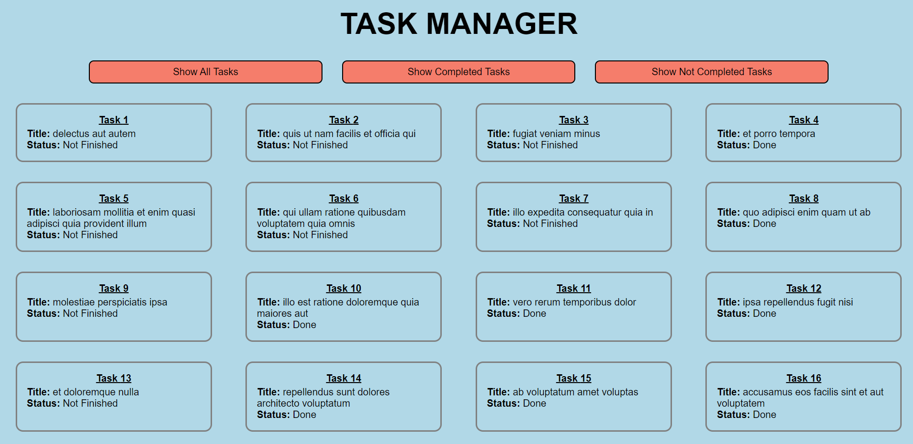
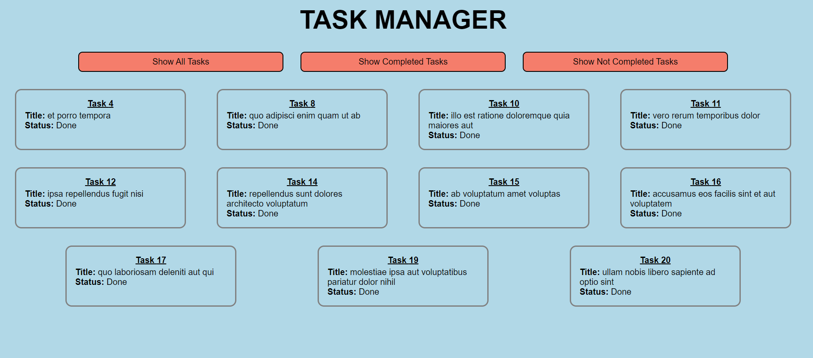
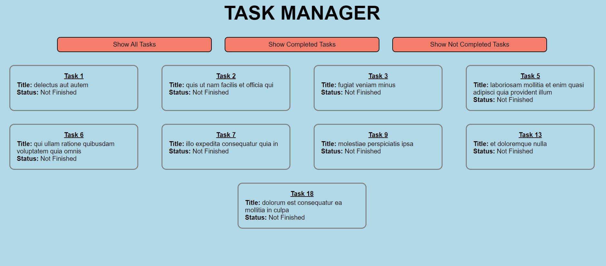

# Task 1 - Creating Tasks manager with React

Create a basic task manager using React:

## Functionalities:

- [x] Button to display all tasks
- [x] Button to display all finished tasks
- [x] Button to display all un-finished tasks

## Screenshots:

_Homepage_

_Clicking 2nd Button to display only finished tasks_

_Clicking 3rd Button to display only unfinished tasks_
