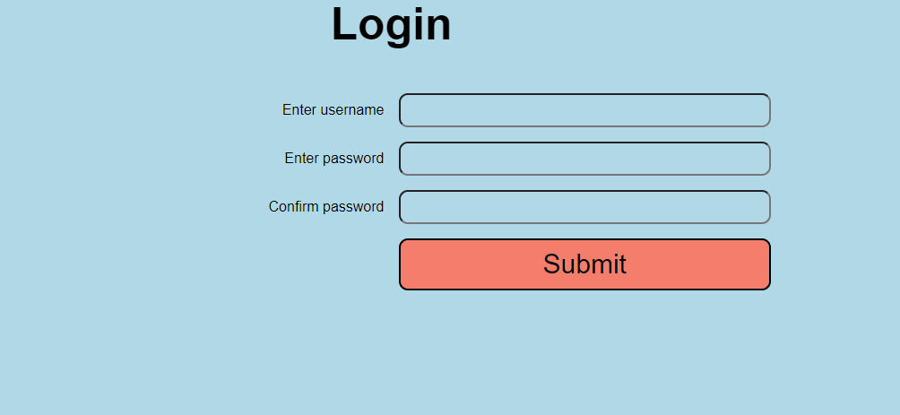
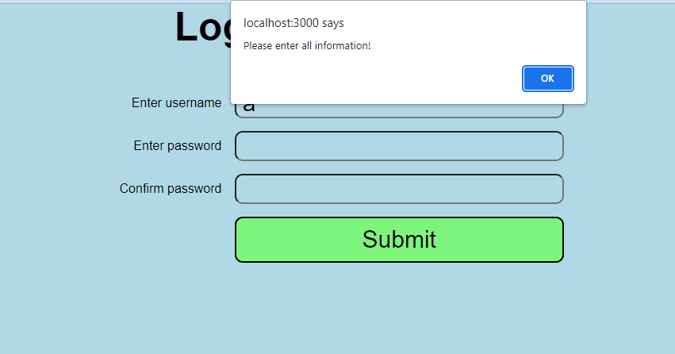
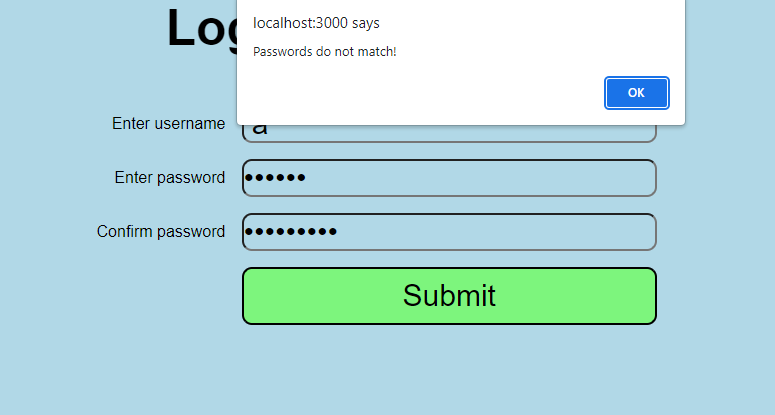

# Task 2 - React Form Handling

Create a basic login page using React:

## Functionalities:

- [x] Required user to fill all inputs
- [x] Alert user if passwords do not match
- [x] Welcome User if log-in successfully

## Screenshots:

  
_Homepage_
  
_Missing Input alert_
  
_Password not matched alert_

_Login successful_
